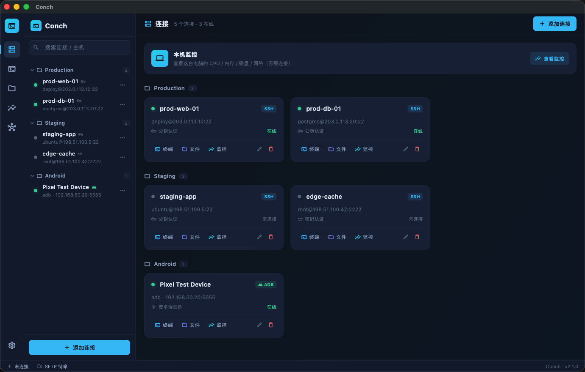
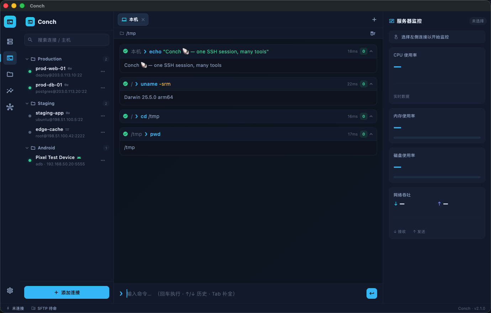
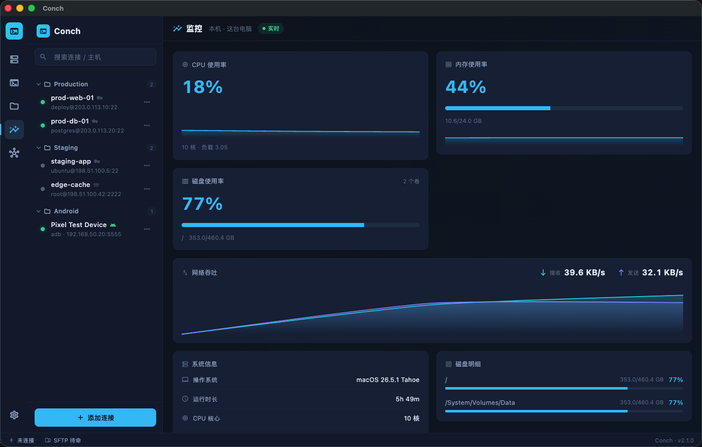

# Conch

Conch is an SSH client written in Rust. A single `r-shell` binary manages saved
connections, runs remote commands, opens an interactive shell, transfers files
over SFTP, and prints a quick system snapshot.

It also ships an optional MCP server, so AI assistants (Cursor, Claude, and other
MCP clients) can work on your servers through one persistent SSH session instead
of spawning a fresh `ssh` process on every step.

There's a desktop app too — a Flutter UI on top of the same Rust core — with a
tabbed terminal, file browser, and live monitoring.

中文文档:[README.zh-CN.md](README.zh-CN.md)

<p align="center">
  <a href="https://github.com/MageGojo/conch/releases/latest"></a>
  <a href="https://github.com/MageGojo/conch/actions/workflows/release.yml"></a>
  
  
  <a href="#license"></a>
</p>

## Screenshots

<p align="center">
  <br>
  <em>Connections dashboard — saved hosts grouped by folder, with a built-in local monitor card.</em>
</p>

<p align="center">
  <br>
  <em>Command-block terminal — each command and its output is its own block, with exit code, timing, and a working directory that persists across blocks.</em>
</p>

<p align="center">
  <br>
  <em>Live monitoring — CPU, memory, disks, and network with real-time charts.</em>
</p>

## Contents

- [Screenshots](#screenshots)
- [Features](#features)
- [Install](#install)
- [Quick start](#quick-start)
- [Commands](#commands)
- [MCP server](#mcp-server)
- [Authentication](#authentication)
- [Configuration](#configuration)
- [Security](#security)
- [Development](#development)
- [Project layout](#project-layout)
- [License](#license)

## Features

| Command | Description |
| --- | --- |
| `connections` | Add, list, update, and remove saved hosts |
| `exec` | Run a single command on a remote host |
| `shell` | Open an interactive PTY shell |
| `ls` | List a remote directory |
| `upload` / `download` | Copy files over SFTP |
| `stats` | One-shot CPU / memory / disk / network snapshot |
| `mcp` | Start the local MCP server |

The same binary runs on macOS, Linux, and Windows. `exec`, `shell`, `upload`, and
`download` work against any POSIX host; `ls` and `stats` expect a Linux host
(they rely on GNU `ls` and `/proc`).

## Install

### Desktop app

Prebuilt desktop builds are on the
[releases page](https://github.com/MageGojo/conch/releases/latest). The runtime
is bundled, so there's nothing else to install.

| Platform | File |
| --- | --- |
| Windows x64 (installer) | `Conch-windows-x64-setup.exe` |
| Windows x64 (portable) | `Conch-windows-x64.zip` |
| macOS | `Conch-macos.zip` |

The builds aren't code-signed yet. On macOS, right-click `Conch.app` → **Open**
the first time; on Windows, choose **More info → Run anyway** if SmartScreen warns.

### CLI

| Platform | File |
| --- | --- |
| macOS (Apple Silicon) | `r-shell-macos-apple-silicon.dmg` |
| macOS (Intel) | `r-shell-macos-intel.dmg` |
| Windows x64 | `r-shell-windows-x64-installer.exe` |

On macOS, mount the DMG and copy the binary onto your `PATH`:

```bash
sudo cp /Volumes/Conch/r-shell /usr/local/bin/r-shell
sudo chmod +x /usr/local/bin/r-shell
xattr -dr com.apple.quarantine /usr/local/bin/r-shell   # clear Gatekeeper quarantine
r-shell --version
```

On Windows, run the installer (it adds `r-shell` to your `PATH`) and open a new
terminal.

### From source

You need Rust and Cargo ([rustup.rs](https://rustup.rs)). No OpenSSL or libssh is
required — Conch uses the pure-Rust `russh` stack.

```bash
git clone https://github.com/MageGojo/conch.git
cd conch
cargo build --release --manifest-path cli/Cargo.toml
sudo install -m 0755 cli/target/release/r-shell /usr/local/bin/r-shell
```

Or run it straight from Cargo without installing:

```bash
cargo run --manifest-path cli/Cargo.toml -- <command> [options]
```

## Quick start

```bash
# save a connection
r-shell connections add --name prod --host 203.0.113.10 --username deploy \
  --auth publickey --key-path ~/.ssh/id_ed25519

# use it
r-shell connections list
r-shell exec -c prod -- uptime
r-shell shell -c prod
r-shell upload   -c prod ./app.tar.gz /tmp/app.tar.gz
r-shell download -c prod /tmp/app.tar.gz ./app-copy.tar.gz
```

Every command that talks to a host takes a target: either a saved connection
(`-c <id|name>`) or inline details. If a password is needed but not given, you're
prompted for it (input isn't echoed).

Common target flags (`exec`, `shell`, `ls`, `upload`, `download`, `stats`):

| Flag | Alias | Description | Default |
| --- | --- | --- | --- |
| `--connection <id\|name>` | `-c` | Use a saved connection | — |
| `--host <host>` | | Ad-hoc host (IP or hostname) | — |
| `--user <user>` | `-u` | Ad-hoc SSH username | — |
| `--port <port>` | `-p` | Ad-hoc SSH port | `22` |
| `--password <pw>` | | Ad-hoc password (prefer the prompt) | — |
| `--key-path <path>` | | Private key path | — |
| `--passphrase <pp>` | | Passphrase for an encrypted key | — |
| `--insecure` | | Skip host-key verification | `false` |

## Commands

Run `r-shell --help` or `r-shell <command> --help` for the full list of options.

### connections

Saved connections live in a local `workspace.json` (see [Configuration](#configuration)).

```bash
r-shell connections list [--json]

r-shell connections add \
  --name prod --host 203.0.113.10 --username deploy --port 22 \
  --auth publickey --key-path ~/.ssh/id_ed25519 \
  --folder Work --description "Production web server"

r-shell connections update <id> --port 2222 --folder Staging
r-shell connections remove <id>
```

Required flags: `--name`, `--host`, `--username`. `--auth` is `password` or
`publickey` (default `password`); `--port` defaults to `22`; `--folder` defaults
to `All Connections`. `update` takes a connection id plus any of the same flags.

### exec

Runs one command and prints its output. Everything after `--` is sent verbatim.

```bash
r-shell exec -c prod -- uname -a
r-shell exec -c prod -- "ls -la /var/www && df -h"
r-shell exec --host 203.0.113.10 --user deploy -- systemctl status nginx
```

### shell

A full interactive PTY in raw mode (vim, htop, less, …). Press `Ctrl-]` to
force-quit the local loop if a session hangs.

```bash
r-shell shell -c prod
```

### ls

```bash
r-shell ls -c prod /var/log
r-shell ls -c prod /var/log --json
r-shell ls -c prod              # defaults to the home directory
```

Columns: kind (`DIR`/`FILE`/`LNK`), permissions, size, modified time, name.
(Linux hosts.)

### upload / download

Single-file transfers over SFTP.

```bash
r-shell upload   -c prod ./local.tar.gz /tmp/remote.tar.gz
r-shell download -c prod /tmp/remote.log ./local.log
```

### stats

Takes two quick samples and prints a snapshot (Linux hosts; relies on `/proc`).

```bash
r-shell stats -c prod
```

```text
OS:      Linux 6.1.0
Uptime:  12d 4h 31m
CPU:     7.4%  (8 cores, load 0.42)
Memory:  61.2%  (4.9/7.8 GB)
Disk:    40.0%  (3.8/9.5 GB)
Network: down 1.5 KB/s  up 320 B/s
```

### mcp

Starts the local MCP server (see below).

```bash
r-shell mcp
# Conch MCP server listening on http://127.0.0.1:9123/mcp
```

## MCP server

`r-shell mcp` starts a local Model Context Protocol server over Streamable HTTP,
bound to `127.0.0.1` only. Point an MCP client at `http://127.0.0.1:9123/mcp`:

```json
{
  "mcpServers": {
    "r-shell": {
      "url": "http://127.0.0.1:9123/mcp"
    }
  }
}
```

For Cursor this goes in `~/.cursor/mcp.json`. Claude Desktop and other clients
add the same URL as a Streamable HTTP server, then restart.

The server keeps one SSH session alive across calls, so an assistant can run
commands and read or write files without reconnecting each time. Sessions live in
memory only, for as long as `r-shell mcp` is running.

Session tools:

| Tool | Description |
| --- | --- |
| `ssh_session_open` | Open or reuse a session; returns a `session_id` |
| `ssh_exec` | Run a command on the session |
| `ssh_read_file` | Read a remote file (UTF-8, or base64 for binary) |
| `ssh_write_file` | Create or overwrite a remote file |
| `ssh_list_dir` | List a remote directory |
| `ssh_sessions_list` / `ssh_session_close` | List or close live sessions |

Connection tools (operate on `workspace.json`):

| Tool | Description |
| --- | --- |
| `r_shell_ssh_connections_list` | List saved connections (credentials removed) |
| `r_shell_ssh_connection_create` / `_update` / `_delete` | Manage saved connections |

Credentials are never returned — list calls only expose booleans such as
`has_password`. The endpoint requires a loopback `Host` header (and a loopback
`Origin`, if one is present); cross-origin and DNS-rebound requests get `403`.

## Authentication

- **Password** — `--auth password` with `--password`, or omit it to be prompted
  at connect time.
- **Public key** — `--auth publickey` with `--key-path` (and `--passphrase` for
  an encrypted key). Paths starting with `~/` are expanded.

Host keys are verified against `~/.ssh/known_hosts` on a trust-on-first-use
basis. The first connection records the key; later connections must match. A
mismatch aborts the connection (a possible man-in-the-middle) until you remove
the offending line from `known_hosts`. `--insecure` skips the check entirely —
use it only for throwaway or local test hosts.

## Configuration

Saved connections are stored as JSON:

| OS | Path |
| --- | --- |
| macOS | `~/Library/Application Support/r-shell/workspace.json` |
| Linux | `~/.local/share/r-shell/workspace.json` |
| Windows | `%LOCALAPPDATA%\r-shell\workspace.json` |

On Unix the file and its directory are created with owner-only permissions
(`0600` / `0700`).

## Security

- Host keys are verified against `known_hosts` (trust-on-first-use); a changed
  key aborts the connection unless `--insecure` is passed.
- Passwords, private keys, and passphrases are never printed or returned by MCP
  calls — list responses only expose `has_password` / `has_private_key_path`.
- Password prompts don't echo input.
- `workspace.json` is owner-only on Unix.
- The MCP server binds to localhost and rejects non-loopback `Host`/`Origin`
  (defeating DNS rebinding and cross-origin access).

## Development

The root `package.json` is a thin wrapper around Cargo:

```bash
pnpm dev      # cargo run -- --help
pnpm check    # cargo check
pnpm test     # cargo test
pnpm build    # cargo build
pnpm fmt      # cargo fmt
```

Or call Cargo directly with `--manifest-path cli/Cargo.toml`. Version bumps go
through `pnpm version:patch|minor|major`, which update `package.json`,
`cli/Cargo.toml`, `cli/Cargo.lock`, and `CHANGELOG.md`.

## Project layout

```text
conch/
├── cli/         # r-shell: the CLI + MCP server (Rust)
├── core/        # shared SSH / MCP core library
├── desktop/     # desktop app (Flutter UI + Rust core)
├── packaging/   # macOS .dmg and Windows installer scripts
├── scripts/     # version-bump helpers
└── .github/     # CI: tests and release builds
```

## License

MIT — see [LICENSE](LICENSE). Maintained by the team at
[ApiZero](https://apizero.cn/). Issues and pull requests are welcome on
[GitHub](https://github.com/MageGojo/conch).
