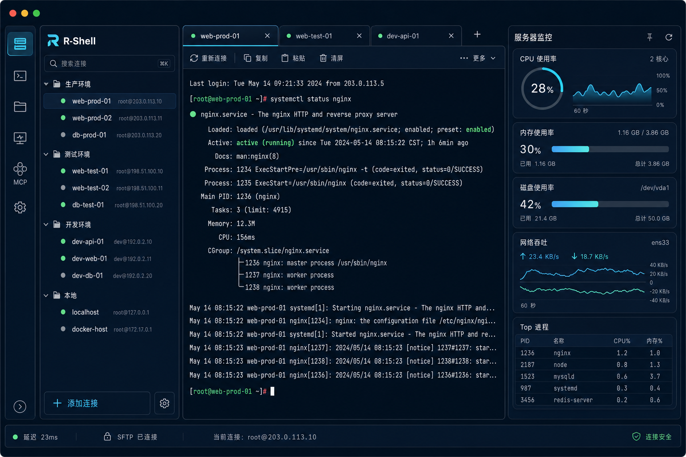

# R-Shell 桌面 GUI — UI 设计规范（Design Spec）

> 状态:设计定稿 v1 | 选型见 [01](01-GUI技术选型对比.md) | 架构见 [02](02-架构设计.md) | 进度见 [进度.md](进度.md) | 落地见 [04-开工文档](04-开工文档.md)
> 设计语言代号:**Midnight Ops** —— FinalShell 的运维信息密度 + 现代开发者工具质感(Warp / Linear / Tokyo Night)。
> 适用栈:**Flutter(Dart)**,主题落在 `desktop/lib/shared/theme/`。所有颜色/间距/圆角/字号一律走 token,**禁止组件内写死 hex**。

---

## 1. 设计语言总览

| 维度 | 取向 | 说明 |
| --- | --- | --- |
| 整体气质 | 深色、专业、克制、信息密集但可扫描 | 运维工具要「一屏看全」,又不能像老式工具那样拥挤廉价 |
| 参考坐标 | FinalShell(布局/监控侧栏) + Warp/Linear/Tokyo Night(质感/配色/间距) | 「现代化一点」= 更大留白、柔和层次、统一圆角、精致强调色、线性图标 |
| 主题模式 | **仅深色(Dark only)** | 终端/运维场景深色为主;浅色 v1 不做(预留 token 扩展位) |
| 强调色 | 青(sky/cyan)为主交互色 + 青绿(teal)渐变 | 终端科技感;绿色专用于「在线/运行」状态,不与交互色混用 |
| 字体 | UI 用 Inter,终端/数据用 JetBrains Mono | 数字一律 tabular(等宽数字),避免跳动 |
| 图标 | Lucide 线性图标,描边 1.5px | 严禁 emoji 当结构图标 |

---

## 2. 设计图索引(高保真稿)

四张核心界面稿,作为视觉与还原基准(源文件在 `docs/gui/design/`):

| 界面 | 文件 | 用途 |
| --- | --- | --- |
| 主界面(三栏:连接树 / 多标签终端 / 监控仪表盘) | `design/rshell-ui-01-main.png` | 旗舰布局基准 |
| SFTP 双栏文件管理 + 传输队列 | `design/rshell-ui-02-sftp.png` | 文件模块基准 |
| 连接编辑弹窗(常规/SSH/高级/备注) | `design/rshell-ui-03-connection-edit.png` | 表单与弹窗基准 |
| MCP 服务器面板(开关/状态/工具清单) | `design/rshell-ui-04-mcp.png` | MCP 模块基准 |

> 稿为视觉基准,**功能数据以 `r-shell-core` 现状为准**(见 §11 对齐说明):图中端口/版本号/进程数等为示意。



---

## 3. 色彩系统(Design Tokens)

### 3.1 背景与表面层级(由深到浅,表达 elevation)

| Token | Hex | 用途 |
| --- | --- | --- |
| `bg.canvas` | `#0B1220` | 应用最底层背景 / 终端底 |
| `surface.1` | `#0F1A30` | 侧栏、状态栏等一级面板 |
| `surface.2` | `#111A2E` | 中心区面板背景 |
| `surface.3` | `#16213B` | 卡片 / 弹窗 / 输入框等抬升面 |
| `surface.hover` | `#1B2742` | 行/卡片悬浮态 |
| `surface.active` | `#22324F` | 选中/激活态底色 |

### 3.2 边框与分隔线

| Token | Hex | 用途 |
| --- | --- | --- |
| `border.subtle` | `#1C2740` | 卡片/面板细边、表格分隔 |
| `border.default` | `#243149` | 常规边框 |
| `border.strong` | `#33425F` | 输入框、可交互控件边 |

### 3.3 文本

| Token | Hex | 对比度(对 `surface.2`) | 用途 |
| --- | --- | --- | --- |
| `text.primary` | `#E6EDF7` | ≈ 13:1 | 标题/正文 |
| `text.secondary` | `#93A4C3` | ≈ 5.6:1 | 次要信息、副标题 |
| `text.muted` | `#5D6B86` | ≈ 3.2:1 | 占位、禁用辅助、表头(仅大字号/非正文) |
| `text.inverse` | `#0B1220` | — | 落在亮色按钮上的文字 |

### 3.4 品牌强调色

| Token | Hex | 用途 |
| --- | --- | --- |
| `accent` | `#38BDF8` | 主交互色:主按钮、选中下划线、焦点环、链接 |
| `accent.hover` | `#5CCBFA` | 主交互悬浮 |
| `accent.pressed` | `#0EA5E9` | 主交互按下 |
| `accent.teal` | `#22D3EE` | 渐变副色 / 图表线 |
| `accent.indigo` | `#818CF8` | 次级高亮(可选,标签/徽标) |
| `accent.gradient` | `linear(135°, #22D3EE → #38BDF8)` | 监控曲线填充、品牌点缀 |

### 3.5 状态色(语义色,必须配图标/文字,不能只靠颜色)

| Token | Hex | 含义 |
| --- | --- | --- |
| `status.online` / `success` | `#34D399` | 在线 / 运行中 / 成功 / 已完成 |
| `status.warning` | `#FBBF24` | 警告 / 等待中 / 高负载 |
| `status.danger` / `error` | `#F87171` | 断开 / 错误 / 停止 / 危险操作 |
| `status.offline` | `#5D6B86` | 未连接(灰点) |
| `status.info` | `#38BDF8` | 提示信息(复用 accent) |

### 3.6 终端 ANSI 调色板(16 色,Tokyo-Night 风格)

终端字节流原样喂给 `xterm.dart`,但默认主题色板需统一:

| 名称 | Normal | Bright |
| --- | --- | --- |
| Black | `#1A1B26` | `#414868` |
| Red | `#F7768E` | `#FF899D` |
| Green | `#9ECE6A` | `#B9F27C` |
| Yellow | `#E0AF68` | `#FAD07B` |
| Blue | `#7AA2F7` | `#8DB0FF` |
| Magenta | `#BB9AF7` | `#D0AAFF` |
| Cyan | `#7DCFFF` | `#A4DAFF` |
| White | `#A9B1D6` | `#E6EDF7` |

- 终端背景 `#0B1220`,前景 `#C0CAF5`,光标 `#38BDF8`,选区 `#28344F`。

### 3.7 监控图表色

- 折线/面积主色:`accent.teal #22D3EE`;填充用 `accent.gradient` 透明渐变(顶 28% → 底 0%)。
- 多序列时按 `#22D3EE → #38BDF8 → #818CF8 → #34D399` 顺序取色。
- 网格线 `#1C2740`(低对比,不抢数据);坐标轴文字 `text.muted`。
- 阈值高亮:>80% 用 `status.warning`,>92% 用 `status.danger`。

---

## 4. 字体排版

| 角色 | 字体 | 说明 |
| --- | --- | --- |
| UI 字体 | **Inter**(随包内置) | 界面所有文本;字重 400/500/600/700 |
| 等宽字体 | **JetBrains Mono**(随包内置) | 终端、命令、路径、文件大小、延迟、端口、工具名 |

字号刻度(8pt 体系衍生):

| Token | px | 用途 |
| --- | --- | --- |
| `text.xs` | 11 | 状态栏、徽标、表头 |
| `text.sm` | 12 | 次要信息、表格内容 |
| `text.base` | 13 | 界面正文(桌面密度首选) |
| `text.md` | 14 | 输入框、按钮、列表项 |
| `text.lg` | 16 | 卡片标题、区块标题 |
| `text.xl` | 20 | 弹窗标题 |
| `text.2xl` | 28 | 大数值(CPU 28% 这类监控主数字) |

- 行高:正文 1.5,标题 1.3,终端 1.35。
- **数字用 tabular figures**(`fontFeatures: [FontFeature.tabularFigures()]`)—— 监控数值、文件大小、延迟必须等宽数字防跳动。
- 长文本优先换行/省略号 + tooltip,不硬截断。

---

## 5. 间距 / 圆角 / 阴影 / 层级

### 5.1 间距(4/8pt 体系)

`space.1=4` · `space.2=8` · `space.3=12` · `space.4=16` · `space.5=20` · `space.6=24` · `space.8=32` · `space.10=40`

- 卡片内边距 16;区块间距 24;列表项纵向内边距 8–10;紧凑表格行高 32。

### 5.2 圆角

`radius.sm=6`(徽标/小控件) · `radius.md=8`(按钮/输入/行) · `radius.lg=10`(卡片/面板) · `radius.xl=14`(弹窗) · `radius.full`(状态点/开关)

### 5.3 阴影(深色下克制,靠边框+微抬升表达层级)

| Token | 值 | 用途 |
| --- | --- | --- |
| `shadow.card` | `0 1px 2px rgba(0,0,0,.30)` | 卡片 |
| `shadow.popover` | `0 8px 24px rgba(0,0,0,.45)` | 下拉/气泡 |
| `shadow.modal` | `0 24px 64px rgba(0,0,0,.55)` | 弹窗 |
| `glow.accent` | `0 0 0 3px rgba(56,189,248,.35)` | 焦点环 / 开关发光 |

### 5.4 层级(z-index / elevation)

`base 0` → `sticky(标签/工具栏) 10` → `dropdown 20` → `tooltip 30` → `drawer 40` → `modal scrim 100` → `modal 101` → `toast 1000`。

---

## 6. 布局规范

主窗口三栏(对齐 [02 §6](02-架构设计.md) 与主界面稿):

```text
┌──┬─────────────┬───────────────────────────┬──────────────┐
│  │ 连接树侧栏    │ 标签栏 + 工具栏            │ 监控仪表盘    │
│图│ (260, 可拖   │ ───────────────────────── │ (300, 可折叠) │
│标│  240–360)    │ 终端 / 文件 / MCP 主区     │ CPU 卡        │
│栏│  搜索 + 分组  │ (弹性, 最小 480)          │ 内存 / 磁盘   │
│56│  连接树       │                           │ 网络 / 进程   │
│  ├─────────────┤                           │              │
│  │ 添加 + 设置   │                           │              │
├──┴─────────────┴───────────────────────────┴──────────────┤
│ 状态栏 (28):  延迟 · SFTP 状态 · 当前连接 · 安全标识         │
└────────────────────────────────────────────────────────────┘
```

| 区域 | 尺寸 | 备注 |
| --- | --- | --- |
| 图标导航栏 | 固定 56 | 连接/终端/文件/监控/MCP/设置;激活项 accent 高亮 + 左侧 2px 指示条 |
| 连接树侧栏 | 默认 260,可拖 240–360,可折叠 | 折叠后仅留图标栏 |
| 中心主区 | 弹性,最小宽 480 | 终端/文件/MCP 在此切换 |
| 监控侧栏 | 默认 300,可折叠 | 钉住/收起按钮 |
| 标签栏 | 高 40 | 标签可关、可新建、可拖拽排序 |
| 工具栏 | 高 36 | 重连/复制/粘贴/清屏/更多 |
| 状态栏 | 高 28 | 全局连接与会话信息 |
| 主窗口最小尺寸 | 1040 × 640 | 低于则监控栏自动折叠 |

---

## 7. 组件规范

每个组件至少定义 5 态:`默认 / 悬浮 hover / 按下 active / 焦点 focus / 禁用 disabled`(禁用 opacity 0.4 + 不可点)。

| 组件 | 关键规格 |
| --- | --- |
| **连接树项** | 高 34;左:状态点(8px,`online/offline/warning`)+ 图标;中:名称(primary)+ `user@host`(muted, mono);悬浮 `surface.hover`,选中 `surface.active` + 左 2px accent 条;右:悬浮露出 ⋮ 菜单 |
| **分组标题** | 可折叠箭头 + 名称(secondary, 12)+ 右侧计数徽标;粘性吸顶 |
| **标签页** | 高 40;关闭 ×;活动标签底部 2px accent 下划线 + 文字 primary,非活动 secondary;左侧连接状态点;`+` 新建 |
| **终端** | `xterm.dart`;§3.6 色板;内边距 12;选区可复制;右键菜单(复制/粘贴/清屏/重连) |
| **主按钮** | 填充 `accent`,文字 `text.inverse`,高 36,圆角 `md`;hover→`accent.hover`,active→`accent.pressed` |
| **次按钮** | 透明底 + `border.strong`,文字 primary;hover `surface.hover` |
| **危险按钮** | `status.danger` 填充或描边,用于停止/删除 |
| **输入框** | 高 36,`surface.3` + `border.strong`,圆角 `md`;focus → accent 边 + `glow.accent`;标签置于上方(非 placeholder-only);密码框带 show/hide 眼睛 |
| **下拉 / 分段控件** | 分段控件用于「认证方式 密码/密钥」「时间范围」;选中段 accent 底 |
| **开关 Switch** | MCP 开关:开启 accent→teal 渐变 + `glow.accent`,关闭 `surface.active` |
| **表格** | 表头 sticky,`text.muted` 12;行高 32,斑马纹可选;支持排序(箭头 + `aria-sort`);数值列右对齐 + tabular |
| **卡片** | `surface.3` + `border.subtle` + `radius.lg` + `shadow.card`;标题 16 + 内容 |
| **进度条** | 高 6,圆角 full,轨道 `surface.active`,进度 `accent.gradient`;旁注百分比/速度(mono) |
| **状态点** | 8px 圆;`online/offline/warning/danger`;需配文字标签(不只靠色) |
| **传输队列行** | 文件名 + 方向(↑上传/↓下载)+ 进度条 + 速度 + 剩余时间 + 状态 chip(上传中/已完成/等待中) |
| **模态** | `radius.xl`,`surface.3`,`shadow.modal`;遮罩 `rgba(0,0,0,.55)`;ESC/× 关闭;有未保存改动二次确认;从触发点 scale+fade 入场 |
| **Toast** | 右下;3–5s 自动消失;不抢焦点;成功/警告/错误三型带图标 |
| **空状态** | 图标 + 一句话 + 操作按钮(如「暂无连接,点击添加」) |
| **骨架屏** | 加载 >300ms 显示 shimmer,替代长时间转圈 |

---

## 8. 图标系统

- 图标集:**Lucide**(Flutter 用 `lucide_icons` 或 `flutter_lucide`),统一线性、描边 1.5px。
- 尺寸 token:`icon.sm=16` · `icon.md=20` · `icon.lg=24`;导航栏图标 20。
- 同一层级同一风格(线性),不混填充/线性。
- 严禁 emoji 作结构图标;品牌 logo 用官方资源。

---

## 9. 动效

| 场景 | 时长 | 曲线 |
| --- | --- | --- |
| 悬浮/按下微交互 | 120–180ms | `easeOut` |
| 标签/面板切换、展开折叠 | 200–260ms | `easeInOut` |
| 弹窗入场 | 240ms scale(0.96→1)+fade | `easeOut` |
| 弹窗出场 | 160ms(≈入场 0.66) | `easeIn` |
| 列表项错峰入场 | 每项 +30ms | — |

- 仅动画 transform/opacity,不动 width/height/top/left。
- 监控曲线更新用平滑过渡,不闪烁;刷新默认 1s(可配)。
- 必须尊重系统 **reduced-motion**:开启时禁用非必要动画,数据立即可读。

---

## 10. 可访问性

- 正文文本对比 ≥ 4.5:1,大字号 ≥ 3:1(本调色板已校验,见 §3.3)。
- 所有可交互元素有可见焦点环(`glow.accent`),Tab 顺序合理,全键盘可达。
- 颜色不作唯一信息载体:状态点旁必带文字/图标。
- 图标按钮带语义标签(`Semantics(label: ...)`);终端/表格有可读语义。
- 危险操作(停止 MCP / 删除连接)需二次确认且视觉与常规操作分离。

---

## 11. 与 `r-shell-core` 的对齐(重要)

设计稿是视觉基准,**真实数据与能力以 core 为准**:

| 设计稿示意 | 核心现状 | GUI 处理 |
| --- | --- | --- |
| MCP 端口(稿中 9123) | core 默认 `127.0.0.1:9123` | 默认 9123,做成**可配置** |
| MCP 工具清单 | core 实际暴露:`ssh_session_open / ssh_exec / ssh_read_file / ssh_write_file / ssh_list_dir / ssh_sessions_list / ssh_session_close` + `r_shell_ssh_connections_list / r_shell_ssh_connection_create / update / delete / r_shell_ssh_tabs_list` | 面板**动态读取** `mcp_status()`,不写死 |
| 连接状态点(绿/灰/黄) | core `ConnectionStatus`:`Disconnected / Connecting / Connected` | 灰=Disconnected,黄(脉冲)=Connecting,绿=Connected |
| 密码/密钥字段 | core **永不回传**明文,仅给 `has_password` / `has_private_key_path` 布尔 | 编辑弹窗:已存凭据显示为「已设置(点击修改)」,不回显明文 |
| 监控数值/曲线 | core `SystemStats`(CPU/内存/交换/磁盘/网络)+ 两次采样算速率 | 卡片字段一一映射;`stats_stream` 周期推送 |
| 文件列表列 | core `RemoteFileEntry`:name/kind/permissions/size/modified | 表格列与之对应(`ls` 限 Linux,提示见 02) |
| 版本号 / 进程 Top5 | 进程 Top 非 core 现有能力 | v1 可先用 `exec` 取 `ps` 临时实现或标注为后续 |

---

## 12. 主题落地(Dart 骨架,Stage 1/7 用)

`desktop/lib/shared/theme/app_colors.dart`(节选,完整在落地时补全):

```dart
import 'package:flutter/material.dart';

/// Midnight Ops 调色板 —— 唯一颜色来源,组件禁止写死 hex。
abstract final class AppColors {
  // 背景 / 表面
  static const canvas      = Color(0xFF0B1220);
  static const surface1    = Color(0xFF0F1A30);
  static const surface2    = Color(0xFF111A2E);
  static const surface3    = Color(0xFF16213B);
  static const surfaceHover = Color(0xFF1B2742);
  static const surfaceActive = Color(0xFF22324F);

  // 边框
  static const borderSubtle  = Color(0xFF1C2740);
  static const borderDefault = Color(0xFF243149);
  static const borderStrong  = Color(0xFF33425F);

  // 文本
  static const textPrimary   = Color(0xFFE6EDF7);
  static const textSecondary = Color(0xFF93A4C3);
  static const textMuted     = Color(0xFF5D6B86);

  // 强调
  static const accent        = Color(0xFF38BDF8);
  static const accentHover   = Color(0xFF5CCBFA);
  static const accentPressed = Color(0xFF0EA5E9);
  static const accentTeal    = Color(0xFF22D3EE);
  static const accentIndigo  = Color(0xFF818CF8);

  // 状态
  static const online  = Color(0xFF34D399);
  static const warning = Color(0xFFFBBF24);
  static const danger  = Color(0xFFF87171);
  static const offline = Color(0xFF5D6B86);

  static const accentGradient = LinearGradient(
    begin: Alignment.topLeft, end: Alignment.bottomRight,
    colors: [accentTeal, accent],
  );
}
```

```dart
abstract final class AppSpacing {
  static const s1 = 4.0,  s2 = 8.0,  s3 = 12.0, s4 = 16.0,
               s5 = 20.0, s6 = 24.0, s8 = 32.0, s10 = 40.0;
}
abstract final class AppRadius {
  static const sm = 6.0, md = 8.0, lg = 10.0, xl = 14.0;
}
```

> 字体:在 `pubspec.yaml` 内置 Inter 与 JetBrains Mono,主题 `fontFamily: 'Inter'`,终端与数据控件用 `'JetBrainsMono'`。

---

## 13. 交付检查清单(实现每个界面后自检)

- [ ] 全部颜色走 `AppColors` token,无写死 hex
- [ ] 文本对比 ≥ 4.5:1;状态不只靠颜色(带点/文字)
- [ ] 可交互元素有 hover/active/focus/disabled 四态 + 可见焦点环
- [ ] 数值(监控/大小/延迟/端口)用等宽 tabular 数字
- [ ] 图标统一 Lucide 线性,无 emoji
- [ ] 动效 120–260ms,仅 transform/opacity,尊重 reduced-motion
- [ ] 触发即反馈 <100ms;加载 >300ms 出骨架屏
- [ ] 凭据不回显明文;危险操作二次确认
- [ ] 三栏可拖/可折叠;窗口缩到最小尺寸不破版
- [ ] 与 core 对齐(端口可配、工具清单动态、状态点映射 ConnectionStatus)
