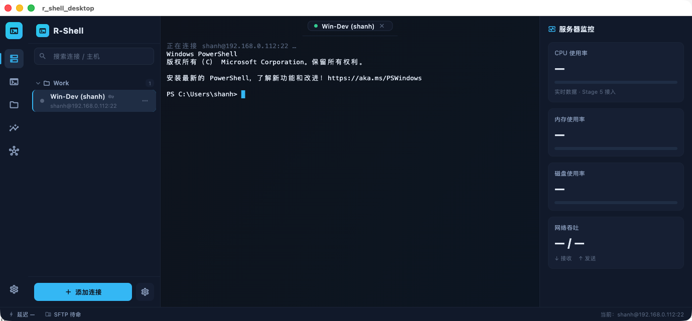
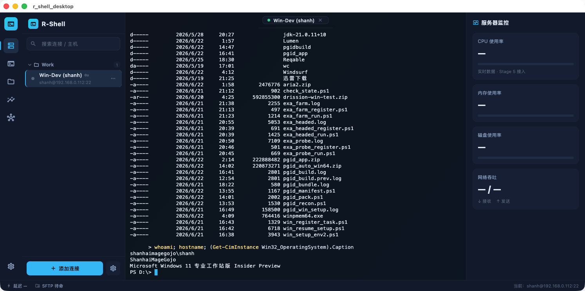

# 真机端到端验证 — 局域网 Windows 开发机（2026-06-22）

> 目的:证明 R-Shell GUI 能真正连上真实主机并取到真实数据,并记录过程中发现/修复的
> **macOS 沙箱致命阻断**。断点续作时本文档是「GUI 已可真机用」的证据与复现步骤。

## 目标主机

| 项 | 值 |
| --- | --- |
| 连接名 | `Win-Dev (shanh)` |
| 主机 | `192.168.0.112`(局域网) |
| 端口 | `22` |
| 用户 | `shanh` |
| 认证 | publickey,私钥 `~/.ssh/pgid_win`(绝对路径入库) |
| 来源 | `pgid_auto` 项目此前在该 Win 机上布的 OpenSSH Server(默认 shell = PowerShell) |

> 说明:该 Win 机为用户本人的开发机,均为本地服务,用户已明确授权连接与读取。

## 关键修复:macOS 沙箱阻断(根因)

`desktop/macos/Runner/DebugProfile.entitlements` 与 `Release.entitlements` 原本:

```xml
<key>com.apple.security.app-sandbox</key><true/>
<!-- 缺 com.apple.security.network.client -->
```

后果:**沙箱 + 无 network-client ⇒ 应用无法发起任何对外连接**,GUI 终端永远连不上;
且沙箱会把数据目录重定向到容器、并禁止读取 `~/.ssh` 下的私钥与 `known_hosts`。这就是
此前 Stage 3「真机端到端没验证成」的隐藏原因。

修复(两个 entitlements 同步):关闭 `app-sandbox`,补 `network.client` + `network.server`。
SSH 客户端本就需要对外连任意主机、读任意路径密钥;本品走 DMG 分发(非 Mac App Store),
与 `pgid_auto` 既有做法一致。

## 复现步骤

```bash
# 1) 编译 CLI(共享 r-shell-core)
cargo build --release --manifest-path cli/Cargo.toml   # 产物:target/release/r-shell

# 2) 把主机公钥写进 known_hosts(非 --insecure,TOFU 记录),GUI 走 TOFU 即顺
./target/release/r-shell exec --host 192.168.0.112 --user shanh \
  --key-path ~/.ssh/pgid_win -- "echo seeded_ok"

# 3) 加连接到共享 workspace.json(沙箱关闭后 GUI 同源读取)
./target/release/r-shell connections add --name "Win-Dev (shanh)" \
  --host 192.168.0.112 --username shanh --port 22 \
  --auth publickey --key-path /Users/shcodegojo/.ssh/pgid_win --folder Work

# 4) 重新编译并启动 GUI(吃到新 entitlements)
cd desktop && flutter run -d macos
```

数据目录(沙箱关闭后,CLI 与 GUI 同源):
`~/Library/Application Support/r-shell/workspace.json`

## 验证输出(真实数据)

### A. CLI `exec`(非交互通道)— 一次性系统快照

```text
OS     = Microsoft Windows 11 专业工作站版 Insider Preview (build 29591)   # exec 走 GBK 码页,中文有乱码
Model  = System manufacturer System Product Name
CPU    = Intel(R) Core(TM) i7-9700 CPU @ 3.00GHz [8C/8T]
RAM    = 15.9 GB
DiskC  = 117.5/118.1 GB used
Uptime = 6d 2h 1m
IPv4   = 192.168.0.112
```

> 富信息命令用 `powershell -EncodedCommand`(UTF-16LE base64)避免多层引号问题
> (参考 `~/Project/.cursor/tmp/winrun.sh`)。

### B. GUI 终端(交互 PowerShell PTY)— 实时交互

GUI 自动对该连接开终端,显示真实 PowerShell banner 与 `PS C:\Users\shanh>`;在其中
`ls D:\` 列出真实开发目录(`pgid_app.zip` / `pgid_auto_win64.zip` / `drission-win-test.zip`
/ `winpmem64.exe` / `win_register_task.ps1` …),并交互执行:

```text
> whoami; hostname; (Get-CimInstance Win32_OperatingSystem).Caption
shanhaimagegojo\shanh
ShanhaiMageGojo
Microsoft Windows 11 专业工作站版 Insider Preview
PS D:\>
```

> 交互 PTY 走 UTF-8,中文「专业工作站版」渲染正常(与 exec 非交互通道的 GBK 乱码对照)。

## 截图





## 结论

- R-Shell **GUI 真机端到端可用**:连接管理 → 会话 → 多标签 PTY 全链路对真实 Windows 主机跑通。
- `stats` / `ls` / 右侧监控仪表盘仍是 Linux 取向(`/proc`、GNU `ls`),对 Windows 不适用 —— 属既有已知边界,后续阶段处理。
